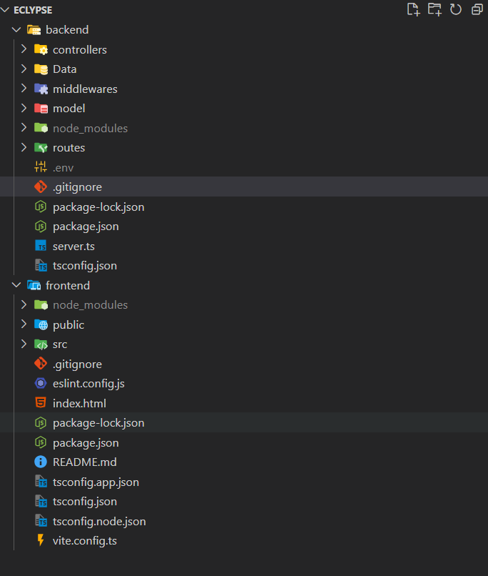

# Eclypse

**Eclypse** is a full-stack eCommerce web application for clothing. It offers a sleek shopping experience with a modern frontend and a scalable backend.

## Note
* It's not complete project.
* For now the backend is connected to the frontend, we are getting data from the backend but is not used yet in the frontend.
* There is no data base.
* The information on the frontend is not dynamic.


## Features
* Shopping cart functionality
* Seamless navigation and user-friendly UI
* Tailwind CSS for responsive and clean design.
* Responsiveness across all devices
* TypeScript-powered backend for robust server-side logic
* React-based frontend with modern component architecture
* Scalable architecture suitable for production deployment
* Used Context Api

## Future Improvement
* Create Database to store all the informations like user info, product info , order info, review
* Create signup, login functionality
* frontend ui get data from the backend
* Page to show the individual product details like description, review, etc
* Search Functionality to search a product.
* User management
* Order cancel, return , etc functionalities.

## Directory Structure



## Getting Started

### Prerequisites

* Node.js (v14 or higher)
* npm or yarn

### Installation

1. Clone the repository:

   ```bash
   git clone https://github.com/Anshit-Sony/Eclypse.git
   cd Eclypse
   ```

2. Install dependencies for both frontend and backend:

   ```bash
   cd backend
   npm install
   cd ../frontend
   npm install
   ```

### Running the Application

1. Start the backend server:

   ```bash
   cd backend
   npx ts-node server.ts
   ```

2. Start the frontend development server:

   ```bash
   cd ../frontend
   npm run dev
   ```


## Tech Stack

* **Frontend:** React, Tailwind CSS, TypeScript
* **Backend:** TypeScript (Node.js)
